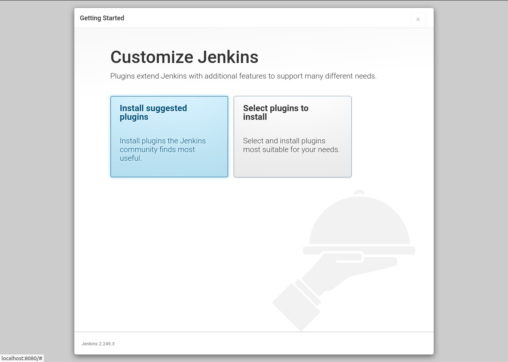
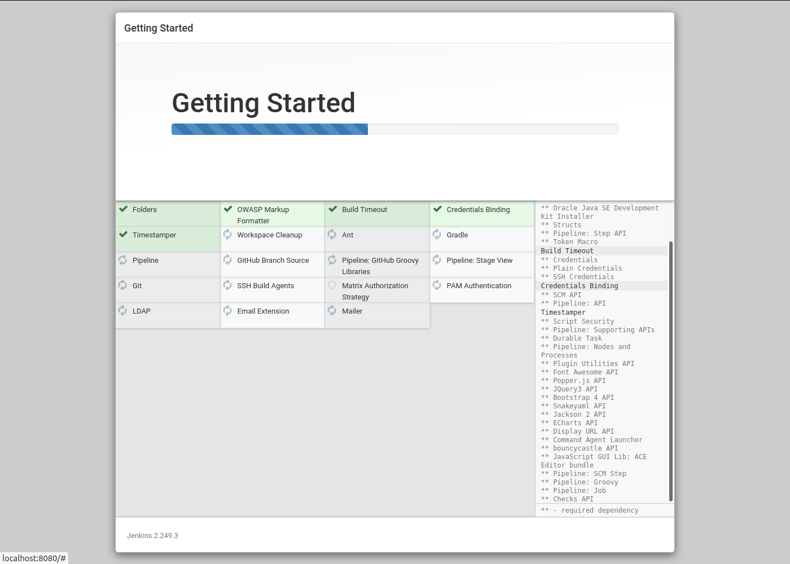
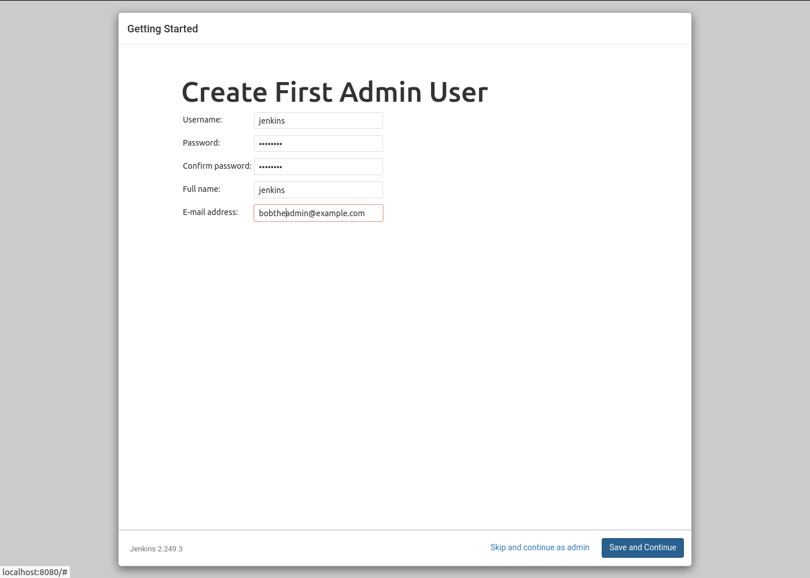
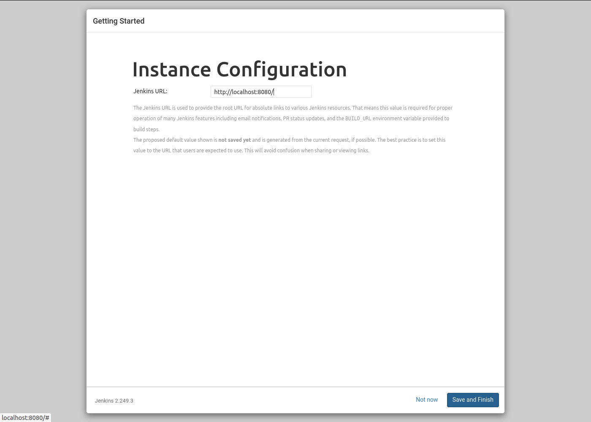
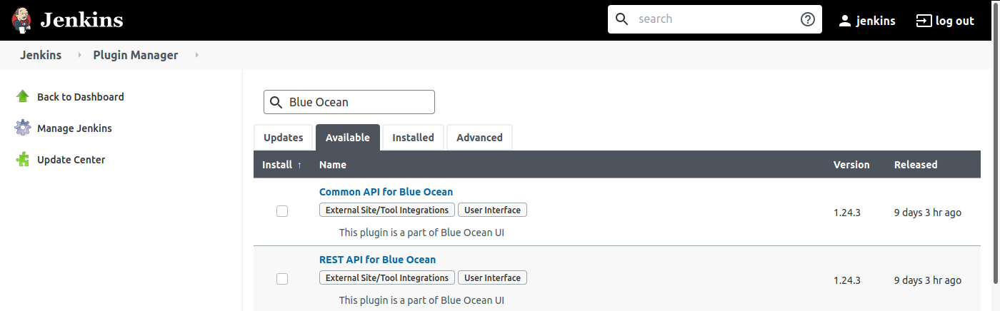
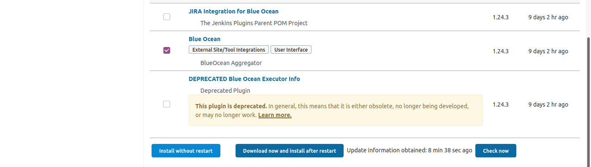
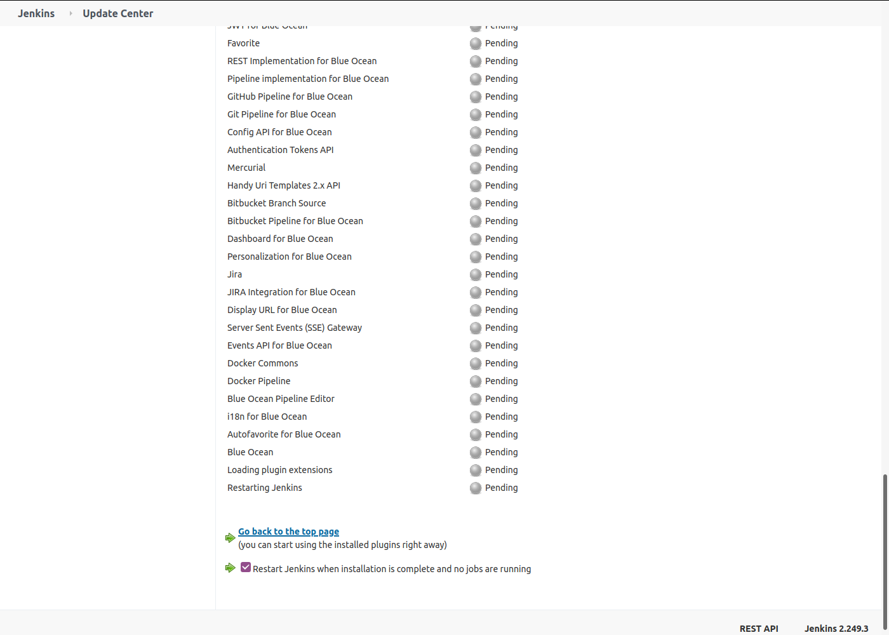
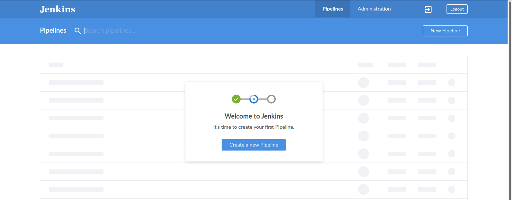
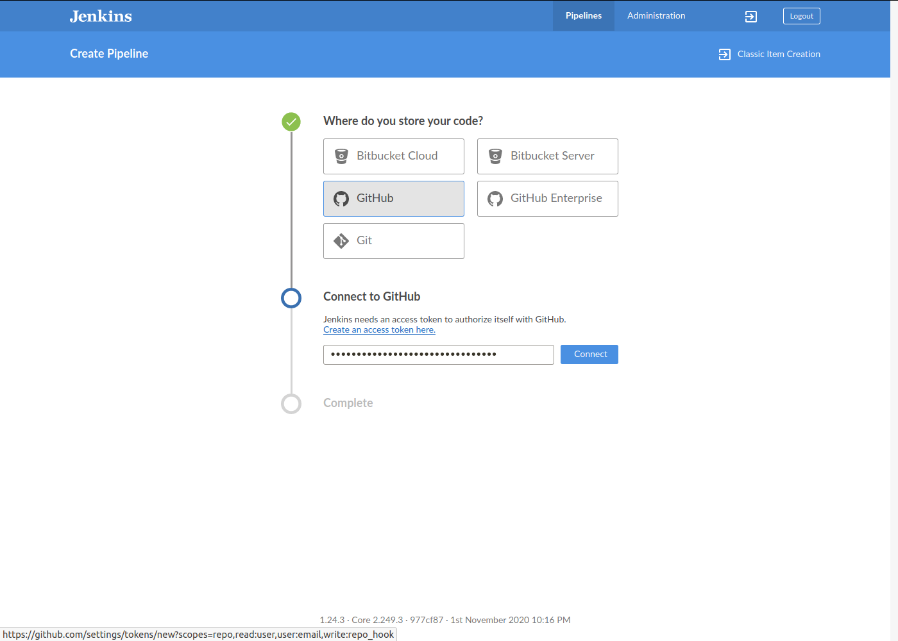

.. _building_server:

Building Artenolis Server
=========================

(work in progress 2020-11-10)

The following 'howto' explains how to setup a Artenolis server starting with a clean Ubuntu 20.04 distribution. Before starting you should have ready the credentials 
to the 'bot' github user (eg cobratoolboxbot). 

If running from a Virtual Machine, set RAM 4GB or higher, disk space 24GB or higher.

When installing Ubuntu 20.04, choose a minimal install with no 3rd party software.
Set the primary user to 'jenkins' with a strong password
and make note of the password. Set the hostname 'artenolis' (or your preferred host name).

.. code-block:: bash

        sudo apt update
        sudo apt install -y git openjdk-11-jre-headless

Download the LTS version of Jenkins from https://www.jenkins.io. Choose the Generic Java Package (war) download. This howto has been written for version 2.249.2 LTS which can be downloaded at
https://get.jenkins.io/war-stable/2.249.3/jenkins.war .  

.. code-block:: bash

	wget https://get.jenkins.io/war-stable/2.249.3/jenkins.war

To run Jenkins using the built in Jetty web server:

.. code-block:: bash

        java -jar jenkins.war

It takes about a minute to start. Logs are echoed to standard output. When Jenkins is finished starting, at the end of the logs you will see the random admin password. Make record of this. The admin password can be retrieve later from file /home/jenkins/.jenkins/secrets/initialAdminPassword. Example:

.. code-block:: bash

	Jenkins initial setup is required. An admin user has been created and a password generated.
	Please use the following password to proceed to installation:

	31032562bf8c4f96a0577790f79c17cc

	This may also be found at: /home/jenkins/.jenkins/secrets/initialAdminPassword

Initial setup of Jenkins
------------------------

Open browser at http://localhost:8080 and enter the admin password when prompted. Choose "Install Suggested Plugins". Allow a few minutes for the plugins to install. 

   

   
For first admin user chose username 'jenkins', full name 'jenkins' and use your own email address. 

   
For the 'Instance Configuration' leave at default http://localhost:8080 for the moment. Click 'Save and Finish'. You are now ready to setup Jenkins for the Artenolis configuration.

Setting up Jenkins for Artenolis
--------------------------------

Artenolis requires the 'Blue Ocean' plugin.  Go to Jenkins -> Manage Jenkins -> Manage Plugins -> Available tab. Search for "Blue Ocean". 

Install plugin "Blue Ocean" aggregate plugin (near the end of the list) by selecting it and clicking on "Install without restart" button.

"Blue Ocean" is an aggretate plugin which loads many sub-plugins. Check the "Restart Jenkins when installation is complete" checkbox to restart Jenkins which will enable the plugin. The installation procedure is likely to take a few minutes. If nothing happens after 5 minutes, try reloading the browser page. If all goes well you will be greeted with the Jenkins login screen.

Now that the Blue Ocean plugin is install, next step is configuring the multi-pipline tests.
After restart a new "Open Blue Ocean" menu option will be on the left column menu. Click on this. Next select "New Pipeline".

   
Select GitHub in response to 'where do you store your code'. If you do not already have a 'personal access token' you can create one by clicking on the link "Create an access token here."  This will open a new tab. Log into github as the bot user. Leave the token options as is. Set the 'note' field to 'artenolis'.

   
Copy the access token, return to the Jenkins browser tab and paste in the access token. If all goes well you will see a list of organizations / repositories belonging to the bot user (if you don't see any you may have to invite the bot user to those organizations).  Select 'opencobra' organization. Select cobratoolbox. Click "Create Pipeline".

Automatically starting Jenkins on boot
--------------------------------------

Create file /home/jenkins/jenkins-start.sh and set an execute flag on it with 'chmod a+x jenkins-start.sh'.

.. code-block:: bash

	#!/bin/bash
	java -jar /home/jenkins/jenkins.war

Create file /etc/systemd/system/jenkins:

.. code-block:: bash

	[Unit]
	Description=Jenkins

	[Service]
	User=jenkins
	ExecStart=/home/jenkins/jenkins-start.sh

	[Install]
	WantedBy=multi-user.target

Now enable the server at boot time:

.. code-block:: bash

	systemctl enable jenkins

Reboot to test the auto-start.

Enabling HTTPS for public server
--------------------------------

A prerequisite to this step is that your server must be accessible from the internet in port 80 and 443 and that it has been given a hostname in DNS (example king.nuigalway.ie).

Jenkins defaults to using port 8080. However best practise is to make this available on the default HTTPS port (443). There are several ways of achiving this. The apporach taken here use the nginx web server as a reverse-proxy to the Jenkins server.

.. code-block:: bash

        sudo add-apt-repository ppa:certbot/certbot
        sudo apt install -y nginx python3-certbot-nginx

Replace file /etc/nginx/sites-available/default with:

.. code-block::

        upstream jenkins {
                server 127.0.0.1:8080 fail_timeout=0;
        }

        server {
                listen 80 default_server;
                listen [::]:80 default_server;

                root /var/www/html;
                index index.html index.htm index.nginx-debian.html;

                server_name artenolis.example.com;

                location / {
                proxy_set_header        Host $host:$server_port;
                proxy_set_header        X-Real-IP $remote_addr;
                proxy_set_header        X-Forwarded-For $proxy_add_x_forwarded_for;
                proxy_set_header        X-Forwarded-Proto $scheme; 
                proxy_set_header        Upgrade $http_upgrade;
                proxy_set_header        Connection "upgrade";
                proxy_pass              http://jenkins;
                }
        }

Replace 'artenolis.example.com' with the proper full host name of the Artenolis server, eg king.nuigalway.ie. Check config file and restart nginx:

.. code-block:: bash

        sudo nginx -t
        sudo systemctl restart nginx

Now run certbot to create a HTTPS certificate (again replace artenolis.example.com' with the correct full host name).

.. code-block:: bash

        sudo certbot --nginx -d artenolis.example.com

Certbot will ask a few questions (eg agreeing to terms and conditions etc). For the final question, choose redirect all traffic to HTTPS (option 2).

If all goes well Jenkins will be accessable from https://artenolis.example.com (again replace the host name)

Reference: "Set up Jenkins on Ubuntu 18.04 with LetsEncrypt (HTTPS) using Nginx" https://medium.com/@kerren_12230/set-up-jenkins-on-ubuntu-18-04-with-letsencrypt-https-using-nginx-7046baa276d9

Automating backup of Jenkins configuration
------------------------------------------

.. code-block:: bash

	git clone https://github.com/sue445/jenkins-backup-script.git
	
	
Backup script

.. code-block:: bash

	#!/bin/bash
	# Backup Artenolis Jenkins configuration
	# Uses backup script at https://github.com/sue445/jenkins-backup-script
	JENKINS_BACKUP=/home/vmhadmin/jenkins-backup-script
	JENKINS_HOME=/home/vmhadmin/.jenkins
	TS=`date +%Y%m%d-%H%M`
	${JENKINS_BACKUP}/jenkins-backup.sh ${JENKINS_HOME} ${JENKINS_BACKUP}/jenkins-backup-${TS}.tar.gz >& ${JENKINS_BACKUP}/backup.log
	
Add to crontab:

.. code-block:: bash

	@daily /home/vmhadmin/scripts/backup-jenkins-config.sh 
	
Remark: the bulk of the configuration backup are the optional Jenkins plugins. Without these the configuration is about 20kB.

Keeping track of important login credentials
--------------------------------------------

Maintaining the Artenolis system will require keeping track of several keys and credentials. These must not be stored in a public code repository.

  * username / password for the GitHub bot user (cobtratoolboxbot)
  * personal access token for GitHub bot user
  * associated email address linked to the GitHub bot user (cobtratoolboxbot@gmail.com)
  * username / password of jenkins user of server
  * username / password of admin user of server

  

