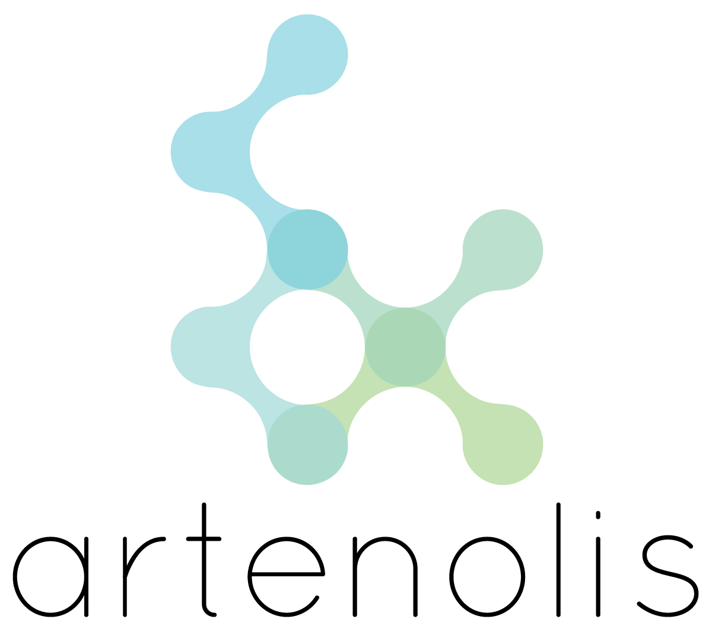

.. _index:

ARTENOLIS
=========

.. rst-class:: under-title

Automated Reproducibility and |br| Testing Environment for Licensed Software

.. raw:: html

    

    

        View ARTENOLIS <strong>source code</strong> on .
    

Automatically testing changes to code is an essential feature of continuous
integration. For open-source code, without licensed dependencies, a variety of
continuous integration services exist. However, a novel automated framework of
continuous integration is required for the development of computational biology
tools in a semi-licensed environment.

Here, we present ARTENOLIS, freely accessible under
http://artenolis.lcsb.uni.lu, a general-purpose and flexible infrastructure
software application that implements continuous integration for open-source
software with licensed dependencies. It uses a master-slave framework, tests
code on multiple operating systems, and multiple versions of licensed software
dependencies. Although ARTENOLIS may used with any software, we illustrate in
detail the developments for the most widely used software of the
COnstraint-Based Reconstruction and Analysis (COBRA) community, namely the
COBRA Toolbox, which is a suite of open-source code for computational modelling
with dependencies on licensed software. As it is dependent on the licensed
software MATLAB (The Mathworks, Inc.), ARTENOLIS is required to ensure
stability, integrity, and cross-platform compatibility.

.. |br| raw:: html

    
