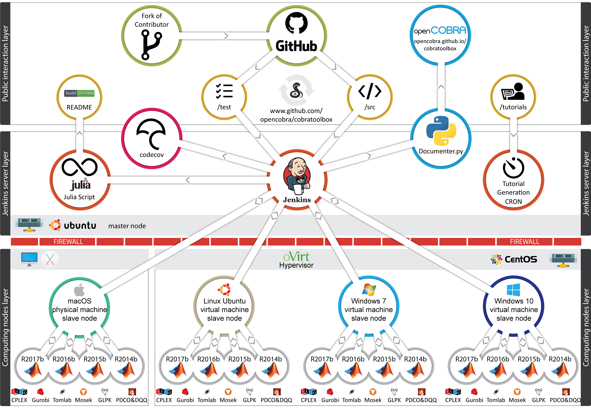

Setup
=====

The core of the infrastructure is Jenkins, the open source automation server
for continuous delivery. The continuous integration infrastructure consists of
a cascade of 3 distinct layers and is a master-slave architecture: a public
interaction layer (top), the Jenkins server layer, and the layer with 4
computing nodes behind a firewall, each running a different operating system. A
change made in a public repository on GitHub (github.com) is seen by the
Jenkins server (master), which in turn triggers multiple builds on the 4
computing nodes simultaneously (slaves).

